<div align="center">

# 🎬 MediaCenter

**Dein portables Medien- und Spielecenter für den USB-Stick.**
Filme, Serien, Musik, Fotos und 11 Spiele – als einzelne Datei für Windows und Linux, ohne Installation und ohne Internet.

[](https://github.com/Richbert0/MediaStick/actions/workflows/build.yml)
[](https://github.com/Richbert0/MediaStick/releases/latest)


</div>

---

## Was ist MediaCenter?

MediaCenter verwandelt einen USB-Stick (oder einen beliebigen Ordner) in eine eigene kleine Mediathek mit Spielhalle:

- **Eine Datei starten, fertig.** Die App bringt alles mit – keinen Python-, Node.js- oder Browser-Download, keine Installation, keine Admin-Rechte.
- **Alles bleibt auf dem Stick.** Medien, Einstellungen, Spielstände und Bestenlisten liegen im Ordner `MediaCenter-Daten` direkt neben der App. Stick an einen anderen PC stecken – alles ist noch da.
- **Fürs ganze Heimnetz.** Die App ist gleichzeitig ein kleiner Server: Handys, Tablets und andere PCs im selben WLAN können über den Browser mitschauen, Dateien hochladen, chatten und gegeneinander spielen.

---

## 🚀 Verwendung

### 1. Herunterladen

Lade die passende Datei aus den **[Releases](https://github.com/Richbert0/MediaStick/releases/latest)** (rechte Spalte auf GitHub):

| System | Datei | Start |
|---|---|---|
| **Windows 10/11** | `MediaCenter-x.y.z-portable.exe` | Doppelklick |
| **Linux** (x64) | `MediaCenter-x.y.z-x86_64.AppImage` | `chmod +x MediaCenter-*.AppImage` und dann Doppelklick oder `./MediaCenter-*.AppImage` |

> 💡 Tipp: Lege die Datei direkt auf den USB-Stick. Beim ersten Start entsteht daneben der Ordner `MediaCenter-Daten`.

### 2. Medien hinzufügen

Entweder **im Upload-Bereich** der App Dateien hineinziehen (die App sortiert automatisch) – oder Dateien direkt in die Ordner kopieren und in der App auf „Aktualisieren“ klicken:

```
📁 USB-Stick
├── MediaCenter-3.2.0-portable.exe      (bzw. .AppImage)
└── 📁 MediaCenter-Daten
    ├── 📁 media
    │   ├── 📁 Movies      ← Filme  (mp4, mkv, webm, …)
    │   ├── 📁 Series      ← Serien, z. B. Series/Dark/Staffel 1/Dark.S01E01.mkv
    │   ├── 📁 Music       ← Musik  (Unterordner = Playlists)
    │   ├── 📁 Images      ← Fotos
    │   └── 📁 Trash       ← Papierkorb
    ├── 📁 api             ← Metadaten, Thumbnails, Bestenlisten
    └── 📁 .profil         ← Einstellungen & Spielstände der App
```

Serien werden am Dateinamen erkannt: `Breaking.Bad.S01E02.mkv`, `Serie 1x05.mp4`, `Folge 3.mp4` oder über Ordner wie `Staffel 2`.
Unter **⚙️ Einstellungen → Speicherort** öffnet der Button **„Medienordner öffnen“** den Ordner direkt im Datei-Explorer.

#### Eigene Ordner einbinden

Medien müssen nicht auf den Stick kopiert werden. Unter **⚙️ Einstellungen → Eigene Medienordner** kannst du **beliebig viele Ordner** hinzufügen, z. B. `D:\Videos`, eine externe Festplatte oder einen Ordner auf dem Stick. Mit **„Durchsuchen…“** wählst du sie bequem aus, auch mehrere auf einmal.

- **Automatisch einsortieren:** Videos → Filme, Videos mit `S01E02` / `1x02` / Ordner „Staffel 1“ → Serien, Audio → Musik (Unterordner werden Playlists), Bilder → Fotos.
- Oder pro Ordner eine feste Kategorie wählen („Nur Musik“ usw.), Ordner kurz deaktivieren oder entfernen. Die Dateien bleiben dabei immer, wo sie sind.
- Ordner auf demselben Stick werden **relativ** gespeichert und funktionieren auch bei anderem Laufwerksbuchstaben. Nicht angeschlossene Laufwerke werden übersprungen.

### 3. Andere Geräte verbinden (LAN)

1. MediaCenter auf einem PC starten.
2. Auf dem Handy/Tablet/Laptop im **selben WLAN** die Adresse öffnen, die in der App angezeigt wird (z. B. `http://192.168.0.10:8080`) – oder einfach den **QR-Code** im Upload-Bereich bzw. in der LAN-Lobby scannen.
3. Fertig: Medien ansehen, Fotos hochladen, chatten oder in der **Spielhalle → LAN-Lobby** gemeinsam spielen.

> Beim ersten Start fragt Windows evtl. nach einer Firewall-Freigabe – für LAN-Funktionen bitte für **private Netzwerke** erlauben.

### 4. Nur als Server starten (ohne Fenster)

Für einen Heim-PC oder Mini-Server ohne Bildschirm:

```bash
MediaCenter-3.2.0-portable.exe --server          # Windows
./MediaCenter-3.2.0-x86_64.AppImage --server     # Linux (funktioniert auch ohne grafische Oberfläche)
```

Optionen: `--port 9000` (anderer Port) · Umgebungsvariable `MEDIACENTER_DATA_DIR=/pfad` (anderer Datenordner).

---

## ✨ Funktionen

### Medien

| Bereich | Highlights |
|---|---|
| 🎬 **Filme** | Player mit Fortsetzen an der letzten Stelle, Suche & Sortierung, eigene Vorschaubilder (Datei oder Standbild aus dem Film) |
| 📺 **Serien** | Automatische Gruppierung nach Serie → Staffel → Episode, Episodentitel aus dem Dateinamen |
| 🎵 **Musik** | Hintergrund-Player, der beim Seitenwechsel weiterspielt und nur pausiert, wenn ein Film oder eine Serie startet · **Visualizer** (Spektrum, Welle, Kreis-Spektrum im Vinyl-Vollbild) · Playlists aus Ordnern |
| ⚙️ **Einstellungen** | Mehrere eigene Medienordner mit automatischer Einsortierung, Speicherort, LAN-Adresse |
| 🖼️ **Fotos** | Galerie mit Vollbild-Ansicht, Titel und Beschreibungen |
| ☁️ **Upload** | Drag & Drop, auch vom Handy per QR-Code; große Videos werden direkt auf den Stick gestreamt; Papierkorb mit Wiederherstellen |
| 💬 **LAN-Chat** | Chat und Sprachchat für alle Geräte im Netz |

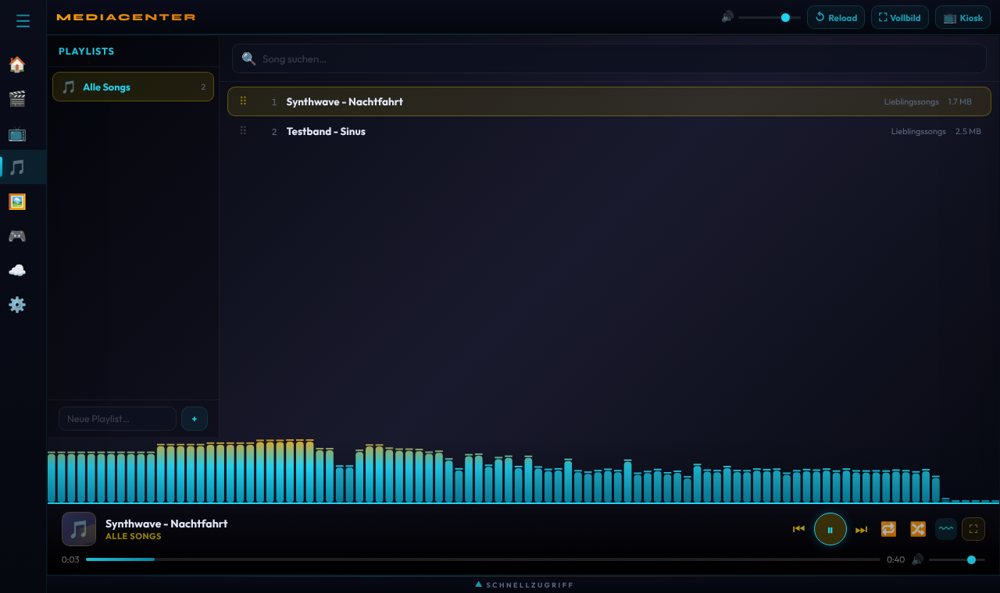 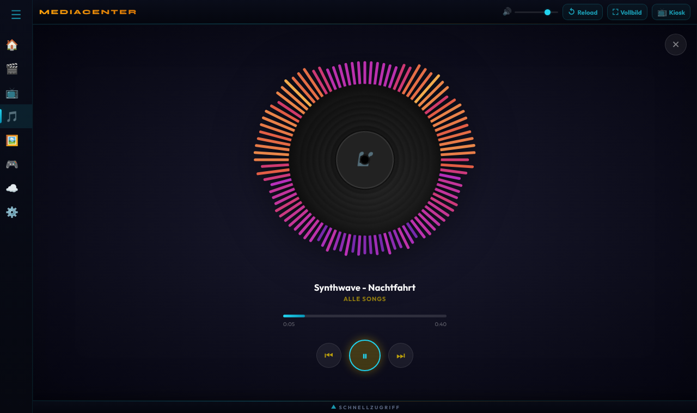

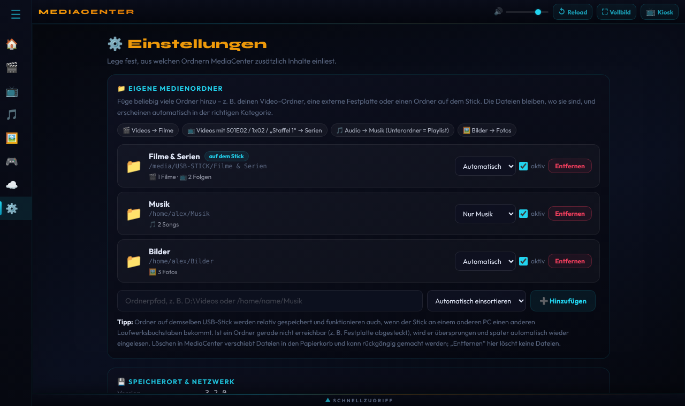

Videos werden mit **HTTP-Range-Streaming** ausgeliefert – Vorspulen funktioniert auch bei großen Dateien sofort.

### 🎮 Spielhalle – 11 Spiele, jedes allein **und** zu zweit spielbar

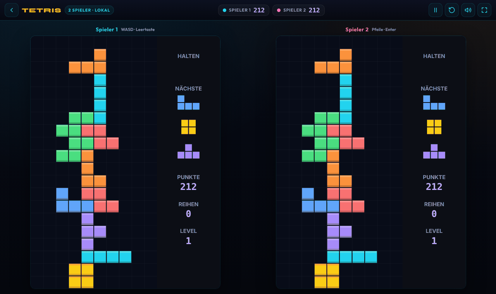 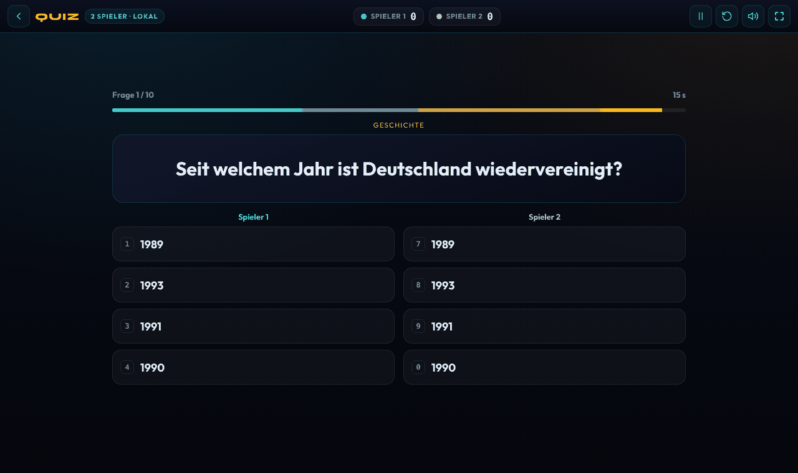

| Spiel | Allein | Gegen KI | 2 Spieler lokal | LAN |
|---|:---:|:---:|:---:|:---:|
| 🐍 **Snake** | ✅ mit Bonus-Futter & Tempo | ✅ 3 Stufen | ✅ Duell auf einem Feld | ✅ 2 Spieler |
| 🧱 **Tetris** | ✅ Halten, Vorschau, Geisterstein | – | ✅ Splitscreen mit Müllreihen | ✅ Duell mit Müllreihen |
| 🔢 **2048** | ✅ mit Animationen | – | ✅ 3-Minuten-Duell | ✅ 3-Minuten-Duell |
| 🧨 **Breakout** | ✅ 5 Level, Power-Ups | – | ✅ Splitscreen-Duell | ✅ Duell |
| 🏓 **Pong** | – | ✅ 3 Stufen | ✅ | ✅ |
| 🃏 **Memory** | ✅ auf Zeit, 3 Größen | ✅ KI mit Gedächtnis | ✅ abwechselnd | ✅ |
| ❌ **Tic Tac Toe** | – | ✅ bis unschlagbar | ✅ | ✅ |
| 🔴 **Vier gewinnt** | – | ✅ starke KI (Alpha-Beta) | ✅ | ✅ |
| ❓ **Quiz** | ✅ 79 Fragen, 8 Themen | – | ✅ Buzzer-Duell | ✅ bis 8 Spieler |
| ➗ **Kopfrechnen** | ✅ 60-Sekunden-Rennen | – | ✅ Buzzer-Duell | ✅ bis 8 Spieler |
| ⌨️ **Tipp-Trainer** | ✅ WPM & Genauigkeit | – | ✅ abwechselnd | ✅ Tipp-Rennen bis 8 Spieler |

**Für alle Spiele gleich:** einheitliches Design, Pause (`P`/`Esc`), Neustart (`R`), Vollbild (`F`), Ton an/aus, Touch-Steuerung auf Handy & Tablet, Bestenlisten, die für alle Geräte im Netz gemeinsam auf dem Stick gespeichert werden.

#### So funktioniert LAN-Spielen

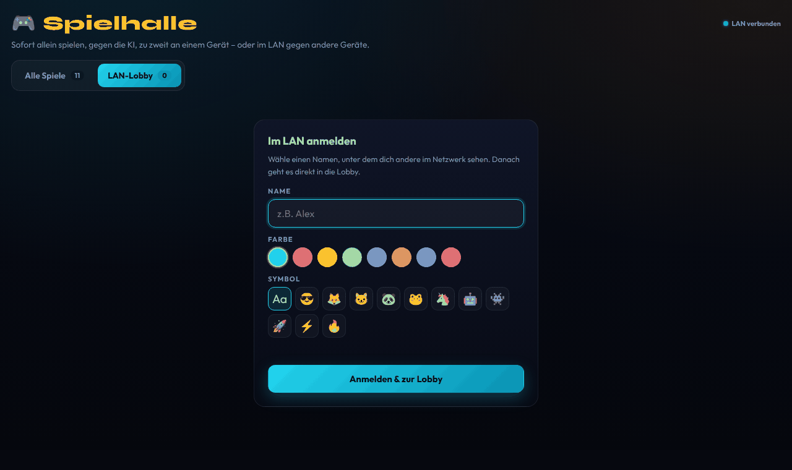 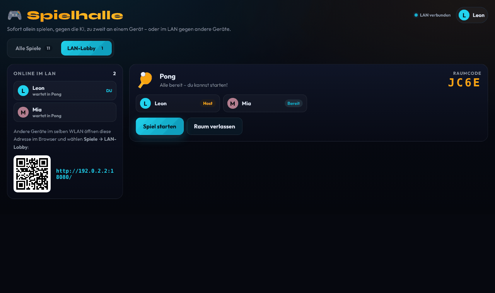

1. **Anmelden:** In der Spielhalle auf **LAN-Lobby** – Name, Farbe und Symbol wählen.
2. **Raum erstellen:** Spiel auswählen. Du erhältst einen **4-stelligen Raumcode**.
3. **Mitspieler holen:** Andere sehen den Raum sofort in der Lobby, treten per Code bei – oder du lädst sie mit einem Klick ein.
4. **Bereit & Start:** Sobald alle „Bereit“ sind, startet der Host. Alle Geräte springen gleichzeitig ins Spiel.
5. **Revanche** mit einem Klick – kurze Verbindungsabbrüche (z. B. WLAN-Wechsel) werden automatisch überbrückt.

#### Steuerung zu zweit an einem Gerät

| Spiel | Spieler 1 | Spieler 2 |
|---|---|---|
| Snake, 2048 | `W` `A` `S` `D` | Pfeiltasten |
| Tetris | `A`/`D` bewegen, `W` drehen, `S` fallen, `Leertaste` ablegen, `Q` halten | Pfeile, `Enter` ablegen, `Shift rechts` halten |
| Pong | `W`/`S` | `↑`/`↓` |
| Breakout | `A`/`D`, `W` startet den Ball | `←`/`→`, `↑` startet den Ball |
| Quiz, Kopfrechnen | `1` `2` `3` `4` | `7` `8` `9` `0` |
| Memory, Tic Tac Toe, Vier gewinnt, Tipp-Trainer | abwechselnd per Maus/Touch/Tastatur | |

---

## 🖼️ Weitere Ansichten

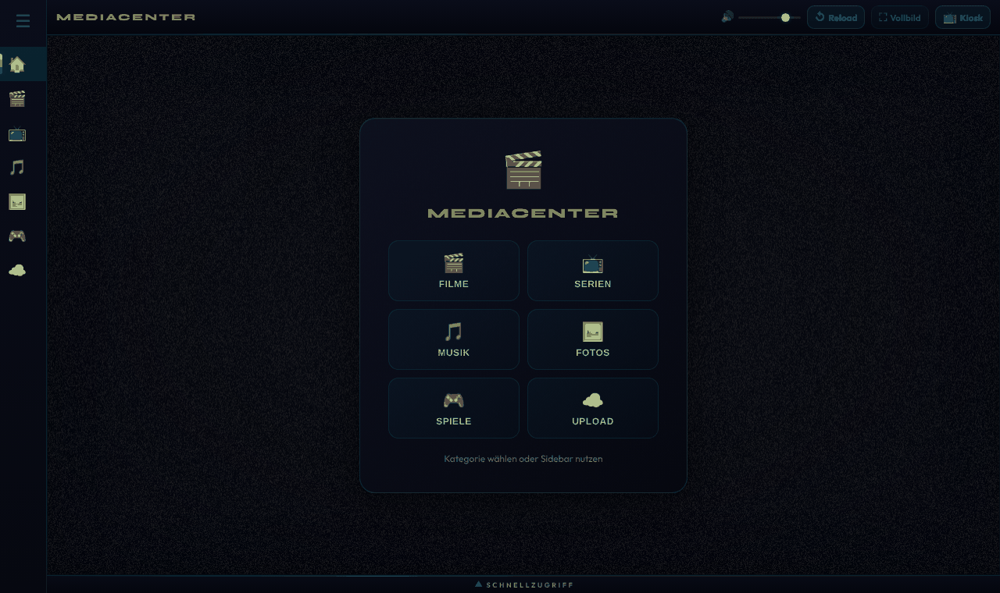 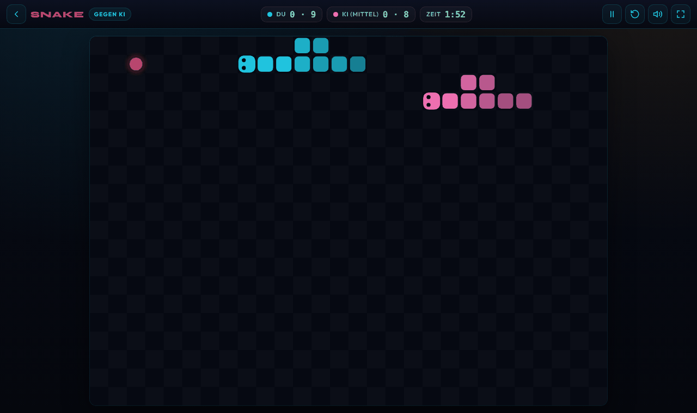
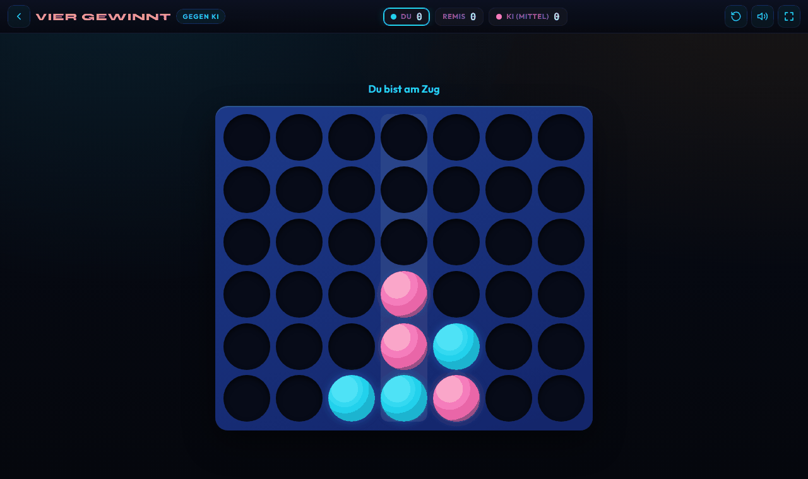 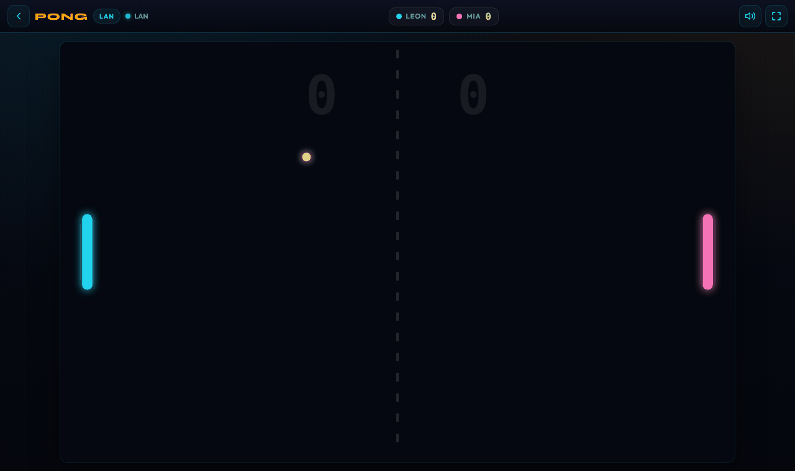

---

## ❓ Häufige Fragen

<details>
<summary><b>Windows zeigt „Der Computer wurde durch Windows geschützt“</b></summary>

Die EXE ist (noch) nicht digital signiert, deshalb kennt Windows den Herausgeber nicht. Lösungen:

- Einmalig **Weitere Informationen → Trotzdem ausführen** klicken.
- Oder: Rechtsklick auf die EXE → *Eigenschaften* → Haken bei **„Zulassen“**.
- **Vom USB-Stick (exFAT/FAT32) gestartet erscheint die Warnung nicht**, weil dort die Download-Markierung verloren geht.

Dauerhaft verschwindet die Meldung mit einer Code-Signatur. Die Build-Pipeline ist dafür vorbereitet: **[Anleitung](docs/SIGNIEREN.md)**. Beim AppImage unter Linux gibt es keine solche Warnung.
</details>

<details>
<summary><b>Das AppImage startet nicht</b></summary>

- Ausführbar machen: `chmod +x MediaCenter-*.AppImage`
- Fehlt FUSE (z. B. Ubuntu 22.04+): `sudo apt install libfuse2` oder starten mit `./MediaCenter-*.AppImage --appimage-extract-and-run`
</details>

<details>
<summary><b>Andere Geräte finden den Server nicht</b></summary>

Alle Geräte müssen im selben Netzwerk sein (kein Gast-WLAN). Prüfe die Firewall-Freigabe für MediaCenter und nutze die in der App angezeigte Adresse bzw. den QR-Code. Läuft Port 8080 schon, nimmt die App automatisch den nächsten freien Port.
</details>

<details>
<summary><b>Der Stick ist schreibgeschützt</b></summary>

Dann speichert MediaCenter die Daten im Benutzerprofil und weist beim Start darauf hin.
</details>

---

## 🛠️ Entwicklung

Voraussetzung: [Node.js](https://nodejs.org) 18 oder neuer.

```bash
npm install          # Abhängigkeiten
npm start            # Desktop-App im Entwicklungsmodus (Daten unter app/)
npm run server       # nur Server, Aufruf im Browser: http://localhost:8080
npm test             # Server- und LAN-Tests
npm run build:win    # portable Windows-EXE  → dist/
npm run build:linux  # Linux-AppImage        → dist/
```

Unter Windows erledigen `start.bat` (Server-Modus) und `BUILD.bat` (Build-Menü) dasselbe per Doppelklick.

**Automatische Builds:** Jeder Push und Pull Request wird per [GitHub Actions](.github/workflows/build.yml) getestet und auf Windows und Linux gebaut (inkl. Start-Test der fertigen App). Pushes auf `main` und Tags `v*` veröffentlichen die Dateien automatisch als **Release**.

### Aufbau

```
├── electron-main.js        Desktop-Hauptprozess (Fenster, portabler Datenordner, --server)
├── preload.js              sichere Brücke zwischen Seite und Desktop
├── server/                 eingebetteter Server (Node.js)
│   ├── index.js            HTTP: Mediathek, Streaming, Upload, Papierkorb, Bestenlisten
│   ├── hub.js              WebSocket: Chat, Lobby, Spielräume
│   ├── library.js          Medien-Scan (Filme/Serien/Musik/Fotos)
│   ├── multipart.js        streamender Upload-Parser
│   └── cli.js              Start ohne Fenster
├── app/                    Oberfläche (HTML/CSS/JS)
│   ├── index.html          Hauptfenster mit Navigation
│   ├── FILME.html · SERIEN.html · MUSIK.html · FOTOS.html · upload.html
│   ├── SPIELE.html         Spielhalle + LAN-Lobby
│   └── games/              11 Spiele + gemeinsames Game-Kit (shared/)
├── test/                   automatische Tests
└── .github/workflows/      CI: Tests, Builds, Releases
```

Alle Abhängigkeiten der fertigen App sind gebündelt: Node.js-Laufzeit (über Electron), WebSocket (`ws`) und QR-Code-Erzeugung (`qrcode`); die Schriftarten Syne und Outfit liegen lokal unter `app/fonts` (SIL Open Font License).
