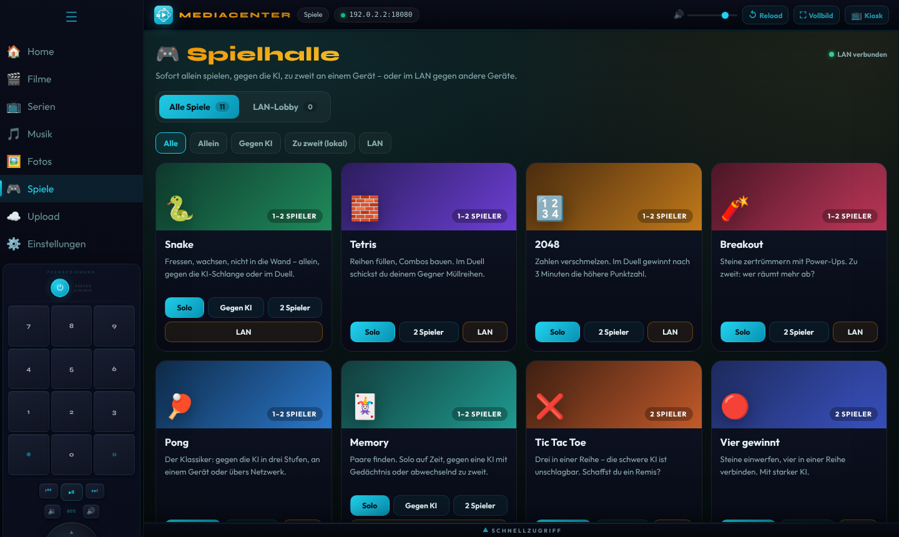

<div align="center">

# 🎬 MediaCenter

**Dein portables Medien- und Spielecenter für den USB-Stick.**
Filme, Serien, Musik, Fotos und 11 Spiele in einer einzigen Datei für Windows und Linux. Du brauchst keine Installation und kein Internet.

[](https://github.com/Richbert0/MediaStick/actions/workflows/build.yml)
[](https://github.com/Richbert0/MediaStick/releases/latest)




</div>

---

## Was ist MediaCenter?

MediaCenter macht aus einem USB-Stick oder einem beliebigen Ordner eine eigene Mediathek mit Spielhalle. Gedacht ist es für den Fernseher im Wohnzimmer, den Laptop unterwegs oder einen alten PC als Heimserver.

| | |
|---|---|
| **Eine Datei, keine Installation** | Die App bringt alles mit: keine Laufzeitumgebung, keine Admin-Rechte, keine Einträge in der Registry. |
| **Alles bleibt auf dem Stick** | Medien, Einstellungen, Designfarbe, Spielstände und Bestenlisten liegen im Ordner `MediaCenter-Daten` neben der App. Steckst du den Stick an einen anderen PC, ist alles noch da. |
| **Fürs ganze Heimnetz** | Die App ist gleichzeitig ein kleiner Server. Handys, Tablets und andere PCs im selben WLAN öffnen sie einfach im Browser. Dort können sie Medien ansehen, Dateien hochladen, chatten und gegeneinander spielen. |
| **Offline und privat** | Es gibt keine Konten, keine Telemetrie und keine Verbindung ins Internet. Alles läuft nur zwischen deinen Geräten. |

---

## 🚀 Schnellstart

1. Lade die passende Datei aus den **[Releases](https://github.com/Richbert0/MediaStick/releases/latest)** herunter (rechte Spalte auf GitHub):

   | System | Datei | Start |
   |---|---|---|
   | **Windows 10/11** (64 Bit) | `MediaCenter-x.y.z-portable.exe` | Doppelklick |
   | **Linux** (x64) | `MediaCenter-x.y.z-x86_64.AppImage` | `chmod +x MediaCenter-*.AppImage`, dann starten |
   | **Raspberry Pi 4/5** & andere ARM64-Geräte | `MediaCenter-x.y.z-arm64.AppImage` | wie Linux, siehe [Raspberry Pi](#-raspberry-pi) |

2. Lege die Datei auf den USB-Stick und starte sie. Daneben entsteht der Ordner `MediaCenter-Daten`.
3. Füge Medien hinzu: über **☁️ Upload**, per Kopieren in die Ordner unten oder mit **⚙️ Einstellungen → Eigene Medienordner**.

> [!IMPORTANT]
> **Linux: Startet das AppImage nicht?** Ubuntu 22.04+, Linux Mint 21+ und Debian 12 brauchen einmalig **libfuse2**:
> `sudo apt install libfuse2` (ab Ubuntu 24.04: `sudo apt install libfuse2t64`).
> Ohne Installation geht es so: `./MediaCenter-*.AppImage --appimage-extract-and-run`

**Systemvoraussetzungen:** Windows 10/11 x64, eine aktuelle Linux-Distribution (x64) oder ein Raspberry Pi 4/5 mit 64-Bit-Raspberry-Pi-OS. Die App selbst braucht etwa 100–120 MB, dazu kommt der Platz für deine Medien. Für die LAN-Funktionen müssen alle Geräte im selben Netzwerk sein.

---

## 📁 Medien organisieren

```
📁 USB-Stick
├── MediaCenter-3.5.1-portable.exe      (bzw. .AppImage)
└── 📁 MediaCenter-Daten
    ├── 📁 media
    │   ├── 📁 Movies      ← Filme
    │   ├── 📁 Series      ← Serien, z. B. Series/Dark/Staffel 1/Dark S01E01.mkv
    │   ├── 📁 Music       ← Musik (Unterordner werden zu Playlists)
    │   ├── 📁 Images      ← Fotos
    │   └── 📁 Trash       ← Papierkorb (wiederherstellbar)
    ├── 📁 api             ← Vorschaubilder, Metadaten, Einstellungen, Bestenlisten
    └── 📁 .profil         ← Browser-Speicher der App (Fortschritt, Fenstergröße …)
```

**Serien erkennen.** Folgen werden am Dateinamen erkannt. Groß- und Kleinschreibung spielt keine Rolle, Trennzeichen sind egal.

| Schreibweise | Beispiel | Ergebnis |
|---|---|---|
| `S1E1` / `S01E01` | `Dark.S01E03.mkv` | Staffel 1, Folge 3 |
| `S1F1` / `S01F01` (F = Folge) | `Dark S02F10.mp4` | Staffel 2, Folge 10 |
| `1x05` | `Serie 1x05.mp4` | Staffel 1, Folge 5 |
| Staffelordner | `Dark/Staffel 2/Folge 3.mp4` | Staffel 2, Folge 3 |

Der Serienname kommt aus dem Ordner (`Series/Dark/…`) oder aus dem Dateinamen vor der Folgennummer.

**Eigene Ordner einbinden.** Unter **⚙️ Einstellungen → Eigene Medienordner** fügst du beliebig viele Ordner hinzu, z. B. `D:\Videos` oder eine externe Festplatte. Die Dateien bleiben, wo sie sind:
- **Automatisch:** Videos werden zu Filmen, Videos mit Folgennummer oder Staffelordner zu Serien. Audio landet in Musik (Unterordner werden Playlists), Bilder in Fotos.
- Alternativ legst du pro Ordner eine feste Kategorie fest oder schaltest einen Ordner vorübergehend ab.
- Ordner auf demselben Stick werden relativ gespeichert. Sie funktionieren also auch, wenn der Stick einen anderen Laufwerksbuchstaben bekommt. Fehlende Laufwerke werden übersprungen.

**Dateiformate**

| Art | Erkannt | Hinweis |
|---|---|---|
| Video | mp4, m4v, webm, mkv, mov, ogv, avi, wmv, mpg, ts, m2ts, 3gp | Abspielbar sind Videos in **H.264/H.265, VP8/VP9 oder AV1** mit AAC-, MP3-, Opus- oder Vorbis-Ton. Bei anderen Codecs (z. B. alte AVI/WMV) zeigt der Player einen Hinweis. |
| Audio | mp3, m4a, aac, flac, wav, ogg, opus, wma, aiff, amr | WMA und AMR werden nicht von jedem Gerät abgespielt. |
| Bild | jpg, png, gif, webp, avif, bmp, svg, tiff, ico | |

Videos werden per **HTTP-Range-Streaming** ausgeliefert. Vorspulen klappt deshalb auch bei großen Dateien und über das WLAN sofort.

---

## ✨ Funktionen

### Medien

| Bereich | Was du damit machen kannst |
|---|---|
| 🎬 **Filme** | Ansicht im Streaming-Stil mit großem Titelbild, den Reihen „Weiterschauen“ und „Neu hinzugefügt“, **eigenen Kategorien** als Reihen und „Alle Filme“ mit Sortierung. Die **Kachelgröße** stellst du über ⊞ ein (S, M, L, XL; pro Gerät). Das **⚙️-Zahnrad** oben rechts schaltet den Bearbeitungsmodus frei: Erst dort lassen sich Vorschaubilder ändern, Kategorien zuweisen und Filme in den Papierkorb verschieben. Der Player bietet echtes Vollbild, eine automatisch ausblendende Steuerleiste und Weiterschauen. Das Vorschaubild wählst du an einer beliebigen Stelle im Video oder lädst ein eigenes Bild hoch. |
| 📺 **Serien** | Ansicht im Streaming-Stil mit Titelbild, den Reihen „Weiterschauen“ und „Neu hinzugefügt“ und Fortschritt pro Folge. Die nächste Folge startet nach einem Countdown. **Am Staffelende fragt die App, ob es mit der nächsten Staffel weitergeht.** Einzelne Folgen kannst du als gesehen markieren oder den Fortschritt zurücksetzen. |
| 🎵 **Musik** | Ein Hintergrund-Player, der beim Wechsel zwischen den Bereichen weiterspielt und nur pausiert, wenn ein Film oder eine Serie startet. Dazu ein **Visualizer** (Spektrum, Welle, Kreis-Spektrum in der Vinyl-Vollbildansicht), Zufall, Wiederholen und Playlists aus Ordnern. Auf dem Handy liegt die Steuerung unten: Visualizer, darunter die Tasten, darunter Titel, Zeit und Lautstärke. Auf dem Handy sind die Playlists eine wischbare Leiste. Über „＋ Neue Playlist“ legst du auch im Hochformat neue an, optional gleich mit dem laufenden Song. |
| 🖼️ **Fotos** | Galerie mit Vollbildansicht, Titeln und Beschreibungen. |
| ☁️ **Upload** | Dateien per Drag & Drop hochladen, auch vom Handy per QR-Code. Die App sortiert sie automatisch in die richtige Kategorie. Große Videos werden direkt auf den Stick geschrieben. Gelöschtes landet im Papierkorb und lässt sich wiederherstellen. |
| 💬 **LAN-Chat** | Text- und Sprachchat für alle Geräte im Netz. Das Fenster lässt sich frei verschieben, auf dem PC auch in der Größe ändern. Position und Größe merkt sich die App. Der 📌-Modus macht es halbtransparent. |
| ⚙️ **Einstellungen** | Eigene Medienordner, **Film-Kategorien** (anlegen, umbenennen, sortieren, löschen), Kachelgröße der Filme, **Designfarbe**, Speicherort und Netzwerkadresse. |

### 🎨 Designfarbe

Unter **⚙️ Einstellungen → Designfarbe** stehen neun abgestimmte Paletten zur Auswahl: Cyan, Blau, Violett, Pink, Rot, Orange, Gold, Grün und Silber. Mit **Eigene Farbe** wählst du eine beliebige **Hauptfarbe** und, wenn du willst, auch die **Zweitfarbe** (sonst sucht die App eine passende aus). Jede Palette besteht aus Hauptfarbe, Zweitfarbe, einem leicht getönten dunklen Hintergrund und passend getönter Schrift. Eigene Farben werden automatisch in einen gut lesbaren Helligkeitsbereich gebracht, damit kein Farbchaos entsteht.

Die Farbe wird auf dem Stick gespeichert. Sie gilt sofort für alle Bereiche, für die Spiele und den Visualizer, und auch für alle verbundenen Handys und PCs.

### 🎬 Film-Kategorien

1. Unter **⚙️ Einstellungen → Film-Kategorien** legst du Kategorien an, z. B. *Action*, *Familie* oder *Weihnachten*. Dort kannst du sie auch umbenennen, mit ▲▼ sortieren und löschen.
2. Auf der Filme-Seite schaltest du mit dem **⚙️-Zahnrad** oben rechts den Bearbeitungsmodus ein, tippst einen Film an und hakst die Kategorien an. Ein Film kann in mehreren Kategorien stehen.
3. Jede Kategorie erscheint als eigene Reihe in der von dir festgelegten Reihenfolge. Filme ohne Kategorie stehen unter „Ohne Kategorie“, und die Suche findet auch Kategorienamen.

Kategorien und Zuordnungen werden auf dem Stick gespeichert. Sie gelten für alle Geräte.

### 🖥️ Bedienung: Vollbild, Kiosk und Tastenkürzel

Ganz oben liegt **eine einzige Leiste** mit Logo, aktuellem Bereich, der **Adresse mit Port** für andere Geräte (Klick kopiert sie), Lautstärke, Neu laden, Vollbild und Kiosk. In der Desktop-App sitzen dort auch Minimieren, Maximieren und Schließen, und die Leiste dient zum Verschieben des Fensters.


| Modus | So startest du ihn | Was passiert |
|---|---|---|
| **Vollbild** | Knopf **⛶ Vollbild** oder `F11` | Die ganze App füllt den Bildschirm. Navigation und Leisten bleiben sichtbar. |
| **Kiosk** | Knopf **📺 Kiosk** | Bildschirmfüllend, nur der Inhalt, ideal für Fernseher und Präsentationen. Die Menüleisten erscheinen, wenn die Maus an den oberen, linken oder unteren Rand fährt. Auf Touch-Geräten tippst du dafür auf den kleinen **⋯**-Griff oben. |
| **Video-Vollbild** | Im Player `F`, Doppelklick oder ⛶ | Das Video füllt den Bildschirm. Danach kehrt die App in den vorherigen Modus zurück. |

**Esc** wirkt immer schrittweise. Erst schließt es das, was gerade offen ist (Video-Vollbild, Player, Serien-Details, Vinyl-Ansicht, Chat), danach beendet es Kiosk bzw. Vollbild. Vollbild und Kiosk bleiben beim Wechsel zwischen den Bereichen und beim „Neu laden“ erhalten.

| Videoplayer | Taste |
|---|---|
| Abspielen/Pause | `Leertaste`, `K`, `Enter` |
| ±10 Sekunden | `←` / `→` (Touch: Doppeltippen links/rechts) |
| Lautstärke | `↑` / `↓` |
| Vollbild / Stumm / Nächste Folge | `F` / `M` / `N` |

**Fernbedienung:** In der Seitenleiste ist eine Fernbedienung eingebaut (Ziffern, Steuerkreuz, Medientasten, Lautstärke). Physische Fernbedienungen und Medientasten der Tastatur funktionieren auch. Wird mit dem Steuerkreuz navigiert, erscheint bei Eingabefeldern eine Bildschirmtastatur. Mit Maus, Touch oder echter Tastatur bleibt sie aus.

### 🎮 Spielhalle: 11 Spiele, alle allein **und** zu zweit spielbar

| Spiel | Allein | Gegen KI | 2 Spieler lokal | LAN |
|---|:---:|:---:|:---:|:---:|
| 🐍 **Snake** | ✅ Bonus-Futter & Tempo | ✅ 3 Stufen | ✅ Duell | ✅ |
| 🧱 **Tetris** | ✅ Halten, Vorschau, Geisterstein | – | ✅ Splitscreen mit Müllreihen | ✅ |
| 🔢 **2048** | ✅ | – | ✅ 3-Minuten-Duell | ✅ |
| 🧨 **Breakout** | ✅ 5 Level, Power-Ups | – | ✅ Splitscreen | ✅ |
| 🏓 **Pong** | – | ✅ 3 Stufen | ✅ | ✅ |
| 🃏 **Memory** | ✅ auf Zeit, 3 Größen | ✅ KI mit Gedächtnis | ✅ | ✅ |
| ❌ **Tic Tac Toe** | – | ✅ bis unschlagbar | ✅ | ✅ |
| 🔴 **Vier gewinnt** | – | ✅ Alpha-Beta-KI | ✅ | ✅ |
| ❓ **Quiz** | ✅ 79 Fragen, 8 Themen | – | ✅ Buzzer-Duell | ✅ bis 8 Spieler |
| ➗ **Kopfrechnen** | ✅ 60-Sekunden-Rennen | – | ✅ Buzzer-Duell | ✅ bis 8 Spieler |
| ⌨️ **Tipp-Trainer** | ✅ WPM & Genauigkeit | – | ✅ | ✅ Tipp-Rennen bis 8 Spieler |

Alle Spiele haben dasselbe Design und dieselbe Bedienung: Pause (`P`/`Esc`), Neustart (`R`), Vollbild (`F`) und Ton an/aus. Auf Handy und Tablet gibt es eine Touch-Steuerung, die Spiele öffnen dort bildschirmfüllend. Die Bestenlisten liegen gemeinsam auf dem Stick und gelten für alle Geräte.

<details>
<summary><b>Steuerung zu zweit an einem Gerät</b></summary>

| Spiel | Spieler 1 | Spieler 2 |
|---|---|---|
| Snake, 2048 | `W` `A` `S` `D` | Pfeiltasten |
| Tetris | `A`/`D` bewegen, `W` drehen, `S` fallen, `Leertaste` ablegen, `Q` halten | Pfeile, `Enter` ablegen, `Shift rechts` halten |
| Pong | `W`/`S` | `↑`/`↓` |
| Breakout | `A`/`D`, `W` startet den Ball | `←`/`→`, `↑` startet den Ball |
| Quiz, Kopfrechnen | `1` `2` `3` `4` | `7` `8` `9` `0` |
| Memory, Tic Tac Toe, Vier gewinnt, Tipp-Trainer | abwechselnd per Maus, Touch oder Tastatur | |
</details>

---

## 📱 Handy, Tablet & LAN

1. Starte MediaCenter auf dem PC.
2. Scanne mit dem Handy den **QR-Code** im Upload-Bereich oder in der LAN-Lobby. Alternativ öffnest du die angezeigte Adresse (z. B. `http://192.168.0.10:8080`) im Browser.
3. Fertig. Das Handy kann jetzt alles, was der PC kann: Filme und Serien streamen (der Fortschritt wird pro Gerät gespeichert), Musik hören, Fotos hochladen, chatten und spielen.

**LAN-Spiele:** Unter **Spielhalle → LAN-Lobby** meldest du dich an (Name, Farbe, Symbol) und erstellst einen Raum mit einem 4-stelligen Code. Lade Mitspieler ein oder lass sie per Code beitreten. Sobald alle bereit sind, startet das Spiel auf allen Geräten gleichzeitig. Revanche geht mit einem Klick, kurze WLAN-Aussetzer werden überbrückt.

**Netzwerk-Details:** Alles läuft über **einen Port** (Standard 8080, HTTP und WebSocket). Ist der Port belegt, nimmt die App automatisch den nächsten freien. Der QR-Code zeigt auf die Netzwerkkarte, über die der PC wirklich im Heimnetz hängt. Virtuelle Adapter wie Hyper-V, VirtualBox, Docker oder VPN werden übergangen. Hat der PC mehrere Netzwerke, kannst du die Adresse unter dem QR-Code umschalten. Eigene Medienordner lassen sich aus Sicherheitsgründen nur direkt am PC ändern.

> Beim ersten Start fragt Windows nach einer Firewall-Freigabe. Erlaube den Zugriff für **private Netzwerke**, sonst erreichen andere Geräte den PC nicht.

### Nur als Server starten (ohne Fenster)

Das eignet sich für einen Heim-PC oder Mini-Server ohne Bildschirm:

```bash
MediaCenter-3.5.1-portable.exe --server          # Windows
./MediaCenter-3.5.1-x86_64.AppImage --server     # Linux (auch ohne grafische Oberfläche)
./MediaCenter-3.5.1-arm64.AppImage --server      # Raspberry Pi
```

Optionen: `--port 9000` (anderer Port) und die Umgebungsvariable `MEDIACENTER_DATA_DIR=/pfad` (anderer Datenordner).

---

## 🍓 Raspberry Pi

MediaCenter läuft als portables AppImage auch auf dem **Raspberry Pi 4 und 5** und auf anderen ARM64-Rechnern. Der Pi eignet sich gut als stromsparende Mediathek am Fernseher oder als dauerhaft laufender Heimserver für Handys und PCs.

**Voraussetzungen**
- Raspberry Pi 4 (empfohlen ab 4 GB RAM) oder Raspberry Pi 5
- **Raspberry Pi OS 64 Bit** (Bookworm oder neuer). Die 32-Bit-Version wird nicht unterstützt. Ob du 64 Bit hast, zeigt `uname -m`: Dort muss `aarch64` stehen.
- Medien auf einem USB-Stick, einer USB-Festplatte oder einer SSD. Die SD-Karte ist für viele Filme meist zu klein und zu langsam.

**Einrichten**

```bash
sudo apt install libfuse2                           # einmalig (Raspberry Pi OS Bookworm); ab Trixie: libfuse2t64
chmod +x MediaCenter-*-arm64.AppImage
./MediaCenter-*-arm64.AppImage                      # mit Fenster (Desktop)
./MediaCenter-*-arm64.AppImage --server             # nur Server, z. B. ohne Bildschirm
```

Wie überall entsteht der Ordner `MediaCenter-Daten` neben dem AppImage. Liegt das AppImage auf dem USB-Stick, kannst du den Stick zwischen Pi und PC hin- und herstecken.

**Automatisch beim Start des Pi öffnen** (mit Bildschirm): Lege die Datei `~/.config/autostart/mediacenter.desktop` an und passe den Pfad zum AppImage an:

```ini
[Desktop Entry]
Type=Application
Name=MediaCenter
Exec=/media/pi/STICK/MediaCenter-3.5.1-arm64.AppImage
```

Mit dem Knopf **📺 Kiosk** läuft die App danach bildschirmfüllend wie eine TV-Oberfläche. Bedienen kannst du sie per Maus, mit der eingebauten Fernbedienung oder über das Handy.

**Als Heimserver ohne Bildschirm** startet ein systemd-Dienst MediaCenter bei jedem Hochfahren. Datei `/etc/systemd/system/mediacenter.service`:

```ini
[Unit]
Description=MediaCenter
After=network-online.target

[Service]
User=pi
ExecStart=/home/pi/MediaCenter-3.5.1-arm64.AppImage --server --appimage-extract-and-run
Restart=on-failure

[Install]
WantedBy=multi-user.target
```

Ersetze `pi` und die Pfade durch deinen Benutzernamen und den Speicherort des AppImages. Danach aktivierst du den Dienst mit `sudo systemctl enable --now mediacenter`. Erreichbar ist er unter `http://<IP-des-Pi>:8080`; die IP zeigt `hostname -I`.

> **Hinweis zur Leistung:** Der Pi 5 spielt Full-HD-Videos (H.264) im Fenster flüssig ab. Der Pi 4 schafft Full-HD meist, bei hohen Bitraten kann es aber ruckeln. 4K-Videos spielt man besser auf dem Handy oder PC ab und nutzt den Pi nur als Server.

---

## ❓ Häufige Fragen

<details>
<summary><b>Windows zeigt „Der Computer wurde durch Windows geschützt“</b></summary>

Die EXE ist noch nicht digital signiert, deshalb kennt Windows den Herausgeber nicht. So startest du sie trotzdem:

- Einmalig auf **Weitere Informationen → Trotzdem ausführen** klicken.
- Oder: Rechtsklick auf die EXE → *Eigenschaften* → Haken bei **„Zulassen“** setzen.
- Vom USB-Stick (exFAT/FAT32) gestartet erscheint die Warnung nicht, weil dort die Download-Markierung verloren geht.

Dauerhaft verschwindet die Meldung mit der kostenlosen Code-Signatur der SignPath Foundation (siehe [Code-Signatur](#-code-signatur)). Beim AppImage unter Linux gibt es diese Warnung nicht.
</details>

<details>
<summary><b>Das AppImage startet nicht</b></summary>

- Mache die Datei ausführbar: `chmod +x MediaCenter-*.AppImage`
- Fehlt **libfuse2** (Ubuntu 22.04+, Mint 21+, Debian 12), installiere es mit `sudo apt install libfuse2`. Unter Ubuntu 24.04 lautet der Befehl `sudo apt install libfuse2t64`. Ohne Installation startest du mit `./MediaCenter-*.AppImage --appimage-extract-and-run`.
</details>

<details>
<summary><b>Das Handy erreicht den PC nicht</b></summary>

- Handy und PC müssen im **selben WLAN** sein. Ein Gast-WLAN trennt die Geräte oft voneinander.
- Unter Windows muss die Firewall-Freigabe für **private Netzwerke** erteilt sein. Ist das Netzwerk als „öffentlich“ eingestuft, stelle es auf „privat“ um.
- Hat der PC mehrere Netzwerkkarten, tippe unter dem QR-Code eine andere Adresse an.
</details>

<details>
<summary><b>Ein Video wird nicht abgespielt</b></summary>

Die App spielt alle Formate ab, die Chromium kann (siehe [Dateiformate](#-medien-organisieren)). Alte AVI-, WMV- oder DivX-Dateien kannst du mit einem Programm wie HandBrake nach MP4 (H.264/AAC) umwandeln.
</details>

<details>
<summary><b>Der Stick ist schreibgeschützt</b></summary>

Dann speichert MediaCenter seine Daten im Benutzerprofil und weist beim Start darauf hin.
</details>

---

## 🔏 Code-Signatur

Kostenlose Code-Signatur bereitgestellt von [SignPath.io](https://about.signpath.io), Zertifikat von der [SignPath Foundation](https://signpath.org).
*Free code signing provided by [SignPath.io](https://about.signpath.io), certificate by [SignPath Foundation](https://signpath.org).*

**Code-Signing-Richtlinie**

- Signiert wird ausschließlich die Windows-Datei `MediaCenter-*-portable.exe`. Sie wird von [GitHub Actions](.github/workflows/build.yml) direkt aus dem Quellcode dieses Repositorys gebaut. Lokal gebaute oder fremde Dateien werden nicht signiert.
- Jede Release-Signatur muss vorher von einem Approver freigegeben werden.
- **Rollen:** Committer und Reviewer: [Richbert0](https://github.com/Richbert0) · Approver: [Richbert0](https://github.com/Richbert0)
- **Datenschutz:** Dieses Programm überträgt keine Informationen an andere vernetzte Systeme, außer wenn der Benutzer es ausdrücklich veranlasst. Beispiele dafür sind das Freigeben von Medien, der Chat oder Spiele im eigenen lokalen Netzwerk. Es gibt keine Telemetrie und keine Verbindung zu Servern im Internet.
  *This program will not transfer any information to other networked systems unless specifically requested by the user or the person installing or operating it.*

Einrichtung und Hintergründe: [docs/SIGNIEREN.md](docs/SIGNIEREN.md).

---

## 🛠️ Entwicklung

Voraussetzung ist [Node.js](https://nodejs.org) 18 oder neuer.

```bash
npm install          # Abhängigkeiten
npm start            # Desktop-App im Entwicklungsmodus
npm run server       # nur der Server, im Browser: http://localhost:8080
npm test             # Server- und LAN-Tests
npm run build:win    # portable Windows-EXE  → dist/
npm run build:linux  # Linux-AppImage (x64)  → dist/
npm run build:linux-arm64  # AppImage für Raspberry Pi / ARM64 → dist/
```

Unter Windows erledigen `start.bat` (Server-Modus) und `BUILD.bat` (Build-Menü) dasselbe per Doppelklick.

**Automatische Builds:** Jeder Push und jeder Pull Request wird per [GitHub Actions](.github/workflows/build.yml) getestet und für Windows, Linux (x64) und ARM64 (Raspberry Pi) gebaut. Das ARM-Paket entsteht nativ auf einem ARM-Runner, und jedes Paket durchläuft einen Start-Test. Pushes auf `main` veröffentlichen die Dateien automatisch als **Release**.

### Aufbau

```
├── electron-main.js        Desktop-Hauptprozess (Fenster, Vollbild, portabler Datenordner, --server)
├── preload.js              sichere Brücke zwischen Oberfläche und Desktop
├── server/                 eingebetteter Server (Node.js, ein Port für HTTP + WebSocket)
│   ├── index.js            Mediathek-API, Range-Streaming, Upload, Papierkorb, Design, QR-Code
│   ├── hub.js              WebSocket: Chat, Sprachchat-Signalisierung, Lobby, Spielräume
│   ├── library.js          Medien-Scan inkl. eigener Ordner und Serienerkennung
│   ├── settings.js         eigene Medienordner und Designfarbe
│   ├── util.js             Dateinamen-Erkennung, LAN-Adressen, Hilfsfunktionen
│   └── cli.js              Start ohne Fenster
├── app/                    Oberfläche (HTML/CSS/JS ohne Build-Schritt)
│   ├── index.html          Hauptfenster: Navigation, Vollbild/Kiosk, Fernbedienung
│   ├── FILME · SERIEN · MUSIK · FOTOS · upload · SPIELE · EINSTELLUNGEN (.html)
│   ├── js/                 Player, Vorschaubild-Editor, Visualizer, Designfarbe, LAN-Adresse
│   ├── components/chat.js  LAN-Chat
│   └── games/              11 Spiele und gemeinsames Game-Kit (shared/)
├── test/                   automatische Tests (node --test)
└── .github/workflows/      CI: Tests, Builds, Releases
```

**Lizenz:** [MIT](LICENSE). Alle Abhängigkeiten der fertigen App sind Open Source und gebündelt: Electron (Chromium + Node.js), `ws` (WebSocket) und `qrcode`. Die Schriftarten liegen lokal unter `app/fonts`: Syne, Outfit und Noto Sans Symbols (SIL Open Font License) sowie Twemoji (CC-BY 4.0, siehe `app/fonts/LICENSE-Twemoji.txt`). Dadurch erscheinen alle Symbole und Emojis auf jedem System, auch ohne installierte Emoji-Schrift (z. B. Raspberry Pi OS).
